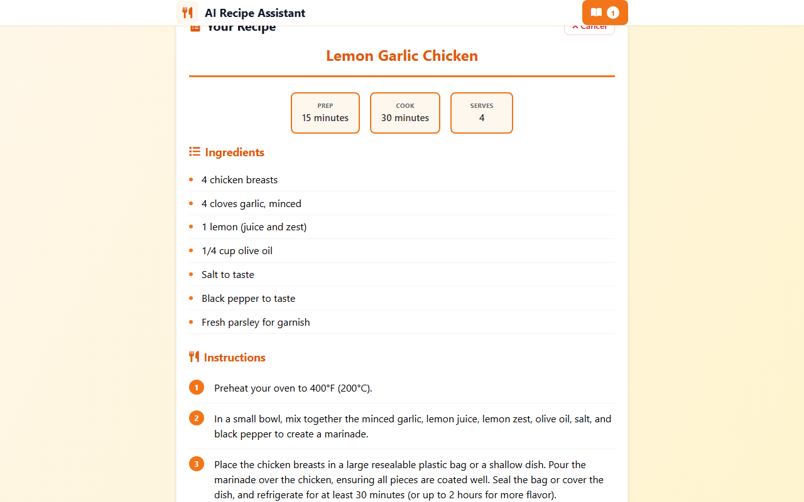
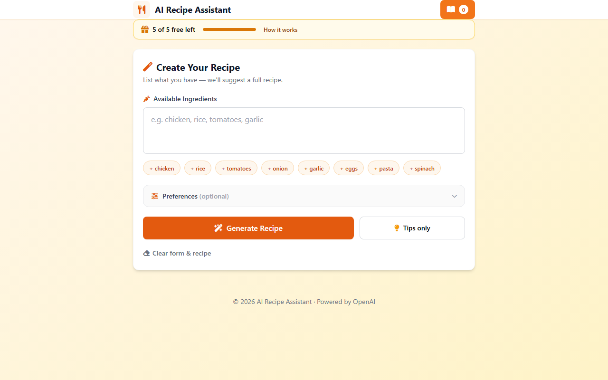
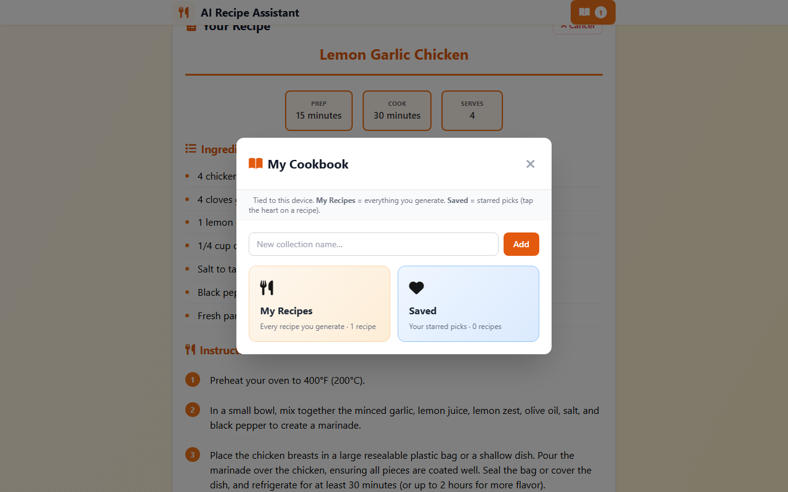
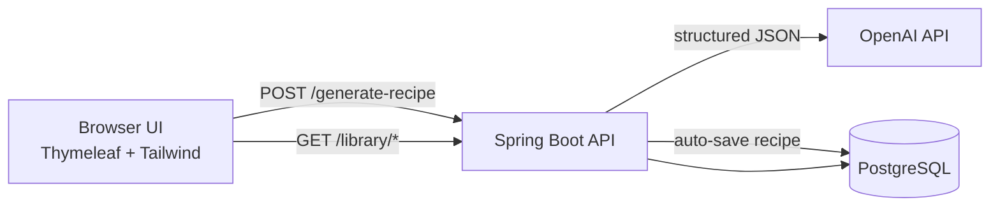

# AI Recipe Assistant

**Turn whatever is in your fridge into a full recipe — ingredients, steps, nutrition, and tips — powered by OpenAI.**

A production-ready Spring Boot app with a polished web UI, device-scoped recipe library, free trial flow, and security hardening suitable for Railway deployment.

<p align="center">
  
</p>

<p align="center">
  <a href="#quick-start">Quick start</a> ·
  <a href="#features">Features</a> ·
  <a href="#security">Security</a> ·
  <a href="RAILWAY.md">Deploy on Railway</a>
</p>

---

## Why this project

Most recipe demos stop at a chat box. This one is built like a small product:

- **Structured output** — recipes render as cards (prep/cook/servings, ingredients, steps, nutrition), not raw markdown.
- **Auto-save library** — every successful generation lands in **My Recipes**; star favorites into **Saved**; organize into custom collections.
- **Fair free trial** — shared server key with per-device limits (cookie), then users bring their own OpenAI key.
- **Security-first** — CSRF, rate limits, encrypted session keys, CSP/HSTS in prod, sanitized API errors.

---

## Screenshots

| Home | Recipe result | Cookbook library |
|------|---------------|------------------|
|  |  |  |
| Trial banner + ingredient form | Structured recipe with Save / Try another | Collections shelf (My Recipes, Saved, custom) |

---

## Features

| Area | What you get |
|------|----------------|
| **Ingredient validation** | `gpt-4o-mini` pre-flight check — rejects non-food input; does **not** use a trial credit |
| **Recipe generation** | OpenAI structured JSON → rich UI (steps, tips, nutrition) |
| **Cooking tips** | Lighter endpoint for tip-only requests (uses a trial credit) |
| **Free trial** | Server `OPENAI_API_KEY` + `ra_client_id` cookie — N recipes per device |
| **Bring your own key** | User `sk-…` key validated and AES-encrypted in the HTTP session |
| **Recipe library** | PostgreSQL-backed, device-scoped via cookie → `User.client_id` |
| **Collections** | System shelves (**My Recipes**, **Saved**) + user-created collections |
| **Legacy import** | One-time `localStorage` favorites → `POST /library/migrate-local` |
| **Rate limiting** | 10 req/min per IP on mutating + library routes |
| **Profiles** | `dev` (verbose) / `prod` (cached templates, secure defaults, Railway auto-detect) |

---

## How it works



1. User enters ingredients (optional preferences: cuisine / dietary).
2. Backend validates ingredients via a lightweight OpenAI call (no trial charge if invalid).
3. Backend resolves API key: **user session key** or **shared trial key** (if credits remain).
4. OpenAI returns strict-schema JSON; backend persists recipe + links to **My Recipes**.
5. User can heart → **Saved**, file into collections, or delete from library.

---

## Stack

| Layer | Technology |
|-------|------------|
| Backend | Java 17, Spring Boot 3.2, Spring Security, JPA, Flyway |
| Database | PostgreSQL (trial usage + recipe library) |
| Frontend | Thymeleaf, bundled Tailwind CSS, vanilla JS |
| AI | OpenAI Chat Completions (`gpt-4o-mini` default) |
| Deploy | Railway ([guide](RAILWAY.md)) |

---

## Quick start

### Prerequisites

- Java 17+
- Maven 3.8+
- PostgreSQL ([setup guide](DATABASE_SETUP.md))

### Run locally

```bash
git clone https://github.com/vishtechie07/ai-recipe-assistant-agent.git
cd ai-recipe-assistant-agent
cp .env.example .env
```

Edit `.env`:

```env
OPENAI_API_KEY=sk-...
APP_ENCRYPTION_KEY=        # unique, ≥32 characters — never use the old placeholder
SPRING_PROFILES_ACTIVE=dev
```

```bash
mvn spring-boot:run
```

After changing HTML/JS classes, rebuild Tailwind: `npm install && npm run build:css`

Open **http://localhost:8080** (hard refresh `Ctrl+Shift+R` after updates).

### Tests

```bash
mvn test
```

---

## Configuration

| Variable | Required | Description |
|----------|----------|-------------|
| `OPENAI_API_KEY` | For trial | Shared demo key; never sent to the browser |
| `APP_ENCRYPTION_KEY` | **Yes** | ≥32 chars; AES-GCM for session-stored user keys |
| `SPRING_DATASOURCE_*` | **Yes** | PostgreSQL connection |
| `SPRING_PROFILES_ACTIVE` | Local: `dev` | Railway: `prod` (auto if `RAILWAY_ENVIRONMENT` is set) |
| `APP_SESSION_COOKIE_SECURE` | Prod: `true` | Secure cookies behind HTTPS proxy |
| `APP_CORS_ALLOWED_ORIGINS` | Prod: **Yes** | Public URL(s), comma-separated |
| `APP_DEFAULT_KEY_MAX_RECIPES` | No | Default `5` free generations per device |
| `OPENAI_MODEL_VALIDATION` | No | `gpt-4o-mini` for ingredient pre-flight |

`.env` in the project root is loaded at startup (gitignored). Use UTF-8 **without BOM** — a BOM breaks dotenv parsing on Windows.

---

## API overview

### Core

| Method | Path | Purpose |
|--------|------|---------|
| `GET` | `/` | Web UI |
| `GET` | `/api-key-status` | Trial / key state |
| `POST` | `/set-api-key` | Validate & store user key (CSRF) |
| `POST` | `/clear-api-key` | Remove user key |
| `POST` | `/generate-recipe` | Generate structured recipe |
| `POST` | `/cancel-generation` | Cancel in-flight generation (pairs with UI Cancel) |
| `POST` | `/get-cooking-tips` | Tips JSON only |

### Library (device-scoped)

| Method | Path | Purpose |
|--------|------|---------|
| `GET` | `/library/collections` | Shelf + total recipe count |
| `POST` | `/library/collections` | Create collection |
| `GET` | `/library/collections/{id}` | Recipes in collection |
| `DELETE` | `/library/collections/{id}` | Delete custom collection |
| `POST` | `/library/collections/{id}/recipes` | Add recipe to collection |
| `DELETE` | `/library/collections/{id}/recipes/{recipeId}` | Remove from collection |
| `GET` | `/library/recipes/{id}` | Full recipe JSON |
| `DELETE` | `/library/recipes/{id}` | Delete recipe everywhere |
| `POST` | `/library/saved/toggle` | Heart — add/remove **Saved** |
| `POST` | `/library/migrate-local` | Import legacy `localStorage` favorites (max 50) |

All `POST`/`DELETE` routes require CSRF header `X-XSRF-TOKEN` (from `XSRF-TOKEN` cookie). Rate limit: **10 requests/minute per IP** → JSON `429`.

---

## Security

| Control | Implementation |
|---------|----------------|
| CSRF | Cookie `XSRF-TOKEN` + header `X-XSRF-TOKEN` |
| Session keys | AES-GCM via `APP_ENCRYPTION_KEY`; placeholder key rejected at startup |
| Trial cookie | `HttpOnly`, `SameSite=Lax`, `Secure` when configured |
| Headers | CSP, `X-Frame-Options: DENY`, Permissions-Policy, HSTS (prod) |
| Errors | OpenAI response bodies never leaked to clients |
| Prod validation | Fails startup if encryption key or CORS origins missing |
| Railway TLS | **Do not** set `SERVER_SSL_ENABLED` — TLS terminates at the edge |

Set OpenAI usage limits on the shared trial key.

---

## Profiles

| Profile | Behavior |
|---------|----------|
| `dev` | DEBUG logs, Thymeleaf hot reload, SQL logging, local encryption default |
| `prod` | INFO/WARN logs, template cache, forward headers, `open-in-view=false`, generic error pages |

---

## Regenerating screenshots

Requires Node.js and a running app at `http://localhost:8080`:

```bash
npm install playwright
npx playwright install chromium
node scripts/capture-screenshots.mjs
```

Output: `docs/screenshots/`.

---

## Future enhancements

Planned or recommended next steps — contributions welcome.

### Product & UX
- [ ] **Account-based library** — sign in to sync recipes across devices (OAuth / magic link)
- [ ] **Recipe editing** — tweak title, steps, or servings after generation
- [ ] **Shopping list** — export ingredients from a recipe or collection
- [ ] **Print / PDF** — polished print stylesheet or downloadable PDF
- [ ] **Recipe sharing** — public read-only links for a single recipe
- [ ] **Meal planning** — weekly board drag-and-drop from library

### AI & backend
- [x] **Ingredient validation** — `gpt-4o-mini` pre-flight; invalid input rejected without trial charge
- [ ] **Streaming generation** — SSE/WebSocket (partial cancel via `/cancel-generation` today)
- [ ] **Cheaper key validation** — done via models list; optional org-scoped key checks later
- [ ] **Model routing** — `gpt-4o` for recipes, `gpt-4o-mini` for tips
- [ ] **Ingredient vision** — photo upload → detected ingredients → recipe
- [ ] **Pantry mode** — subtract what you already have from shopping suggestions

### Engineering & ops
- [x] **Remove dead code** — legacy favorites DTOs/entities removed
- [x] **Flyway migrations** — `ddl-auto=validate`; baseline + `V1`/`V2` migrations
- [x] **Testcontainers** — optional Postgres in tests (falls back to local DB)
- [x] **Bundled Tailwind** — no CDN; stricter CSP (`script-src 'self'`)
- [x] **BOM-safe `.env`** — custom loader strips UTF-8 BOM on Windows
- [x] **Cheap API key validation** — `GET /v1/models` instead of a completion call
- [x] **Cancellable generation** — `POST /cancel-generation` + no trial charge on cancel
- [x] **E2E screenshots** — `scripts/capture-screenshots.mjs` (Playwright)
- [ ] **E2E tests** — Playwright suite in CI
- [ ] **Observability** — structured logs, metrics, OpenAI cost tracking per device/user

---

## License

MIT — see [LICENSE](LICENSE).
